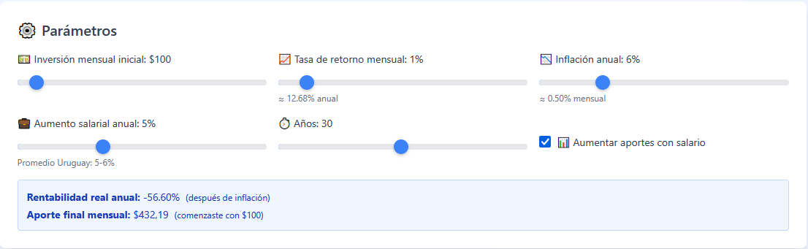
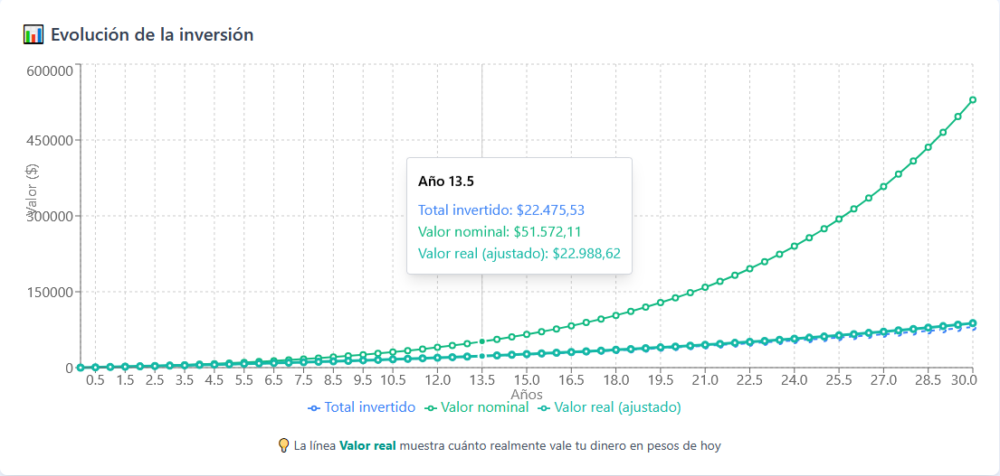
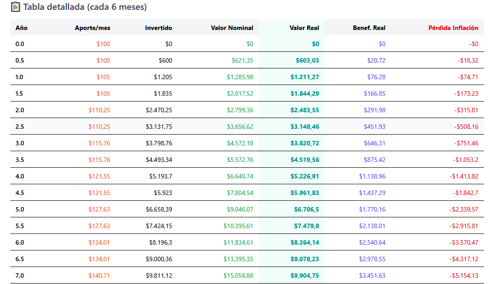

# 💰 Calculadora de Inversiones con Interés Compuesto

Una calculadora interactiva y profesional para simular inversiones con interés compuesto, ajustada por inflación y aumentos salariales en Uruguay.

[](https://investment-calculator-beta-eight.vercel.app/)
[](https://nextjs.org/)
[](https://reactjs.org/)
[](https://tailwindcss.com/)

## 🚀 Demo en Vivo

👉 **[Ver Aplicación](https://investment-calculator-beta-eight.vercel.app/)**

## 📸 Capturas de Pantalla

### Panel de Parámetros


### Valores Nominales y Reales


### Gráficos Interactivos


### Tabla Detallada


## ✨ Características

- 📊 **Cálculo de Interés Compuesto Mensual**: Simula inversiones con capitalización mensual
- 💸 **Ajuste por Inflación**: Calcula valores reales considerando la inflación uruguaya
- 📈 **Aumentos Salariales**: Simula el crecimiento de tus aportes según aumentos salariales
- 💵 **Valores Nominales y Reales**: Compara el valor nominal vs poder adquisitivo real
- 📉 **Visualización Interactiva**: Gráficos dinámicos con Recharts
- 📋 **Tabla Detallada**: Proyección semestral completa de tu inversión
- 🎨 **UI/UX Moderna**: Diseño responsive y atractivo con Tailwind CSS
- ⚡ **Alto Rendimiento**: Optimizado con Next.js 16 y Turbopack
- 📱 **100% Responsive**: Funciona perfectamente en móviles, tablets y desktop

## 🛠️ Tecnologías

- **Framework**: [Next.js 16](https://nextjs.org/) - React framework con Turbopack
- **UI Library**: [React 18](https://reactjs.org/) - Biblioteca para interfaces de usuario
- **Estilos**: [Tailwind CSS v4](https://tailwindcss.com/) - Framework CSS utility-first
- **Gráficos**: [Recharts](https://recharts.org/) - Biblioteca de gráficos para React
- **Lenguaje**: JavaScript (ES6+)
- **Deploy**: [Vercel](https://vercel.com/) - Plataforma de deployment

## 📦 Instalación

### Prerrequisitos

- Node.js 18.x o superior
- npm o yarn

### Pasos

1. **Clonar el repositorio**

```bash
git clone https://github.com/guariscofernando/investment-calculator.git
cd investment-calculator
```

2. **Instalar dependencias**

```bash
npm install
```

3. **Ejecutar en desarrollo**

```bash
npm run dev
```

4. **Abrir en el navegador**

```
http://localhost:3000
```

## 🔨 Scripts Disponibles

```bash
# Desarrollo
npm run dev          # Inicia el servidor de desarrollo

# Producción
npm run build        # Crea el build de producción
npm start           # Inicia el servidor de producción

# Utilidades
npm run lint        # Ejecuta el linter
```

## 📂 Estructura del Proyecto

```
investment-calculator/
├── app/
│   ├── page.js           # Página principal
│   ├── layout.js         # Layout de la aplicación
│   └── globals.css       # Estilos globales
├── components/
│   ├── InvestmentCalculator/
│   │   ├── index.js              # Componente principal
│   │   ├── ParametersPanel.js    # Panel de parámetros
│   │   ├── SummaryCards.js       # Tarjetas de resumen
│   │   ├── Charts.js             # Componentes de gráficos
│   │   └── DataTable.js          # Tabla de datos
│   └── ui/
│       └── Card.js               # Componentes UI reutilizables
├── hooks/
│   └── useInvestmentCalculation.js  # Hook de cálculos
├── utils/
│   └── calculations.js           # Funciones de cálculo
└── types/
    └── index.ts                  # Tipos TypeScript (opcional)
```

## 🎯 Casos de Uso

### Para Inversores
- Planificar inversiones a largo plazo
- Comparar diferentes escenarios de retorno
- Entender el impacto de la inflación en tus ahorros

### Para Educación
- Enseñar conceptos de interés compuesto
- Visualizar el poder del ahorro constante
- Demostrar el efecto de la inflación

### Para Asesores Financieros
- Mostrar proyecciones a clientes
- Comparar diferentes estrategias de inversión
- Explicar conceptos financieros de forma visual

## 📊 Parámetros Configurables

| Parámetro | Rango | Valor por Defecto | Descripción |
|-----------|-------|-------------------|-------------|
| Inversión Mensual | $50 - $1,000 | $100 | Monto a invertir cada mes |
| Tasa de Retorno | 0.1% - 10% | 1% | Retorno mensual esperado |
| Inflación Anual | 0% - 25% | 6% | Inflación anual (Uruguay ≈6%) |
| Aumento Salarial | 0% - 15% | 5% | Aumento salarial anual |
| Años | 1 - 60 | 30 | Horizonte de inversión |

## 🇺🇾 Datos de Uruguay

La calculadora viene pre-configurada con datos realistas para Uruguay:

- **Inflación promedio**: ≈6% anual
- **Aumento salarial promedio**: 5-6% anual
- Valores ajustados a la realidad económica uruguaya

## 🤝 Contribuciones

Las contribuciones son bienvenidas. Si deseas contribuir:

1. Fork el proyecto
2. Crea una rama para tu feature (`git checkout -b feature/AmazingFeature`)
3. Commit tus cambios (`git commit -m 'Add some AmazingFeature'`)
4. Push a la rama (`git push origin feature/AmazingFeature`)
5. Abre un Pull Request

## 📝 Roadmap

- [ ] Agregar exportación a PDF
- [ ] Permitir comparar múltiples escenarios
- [ ] Agregar gráficos de torta para distribución
- [ ] Integrar con APIs de tasas reales de Uruguay
- [ ] Modo oscuro
- [ ] Múltiples idiomas (ES/EN)
- [ ] Guardar escenarios en localStorage

## 📄 Licencia

Este proyecto está bajo la Licencia MIT. Ver el archivo [LICENSE](LICENSE) para más detalles.

## 👨‍💻 Autor

**Tu Nombre**

- GitHub: [@guariscofernando](https://github.com/guariscofernando)
- LinkedIn: [fernando-guarisco-5396bb191](https://linkedin.com/in/fernando-guarisco-5396bb191)
- Email: guarisco.fernando@gmail.com

## 🙏 Agradecimientos

- Inspirado en la necesidad de herramientas financieras accesibles
- Datos económicos basados en información pública del BCU (Banco Central del Uruguay)
- Diseño inspirado en las mejores prácticas de UX/UI modernas

---

⭐ Si te resultó útil este proyecto, considera darle una estrella en GitHub

🐛 ¿Encontraste un bug? [Reporta un issue](https://github.com/tu-usuario/investment-calculator/issues)

💡 ¿Tienes una sugerencia? [Abre una discusión](https://github.com/tu-usuario/investment-calculator/discussions)